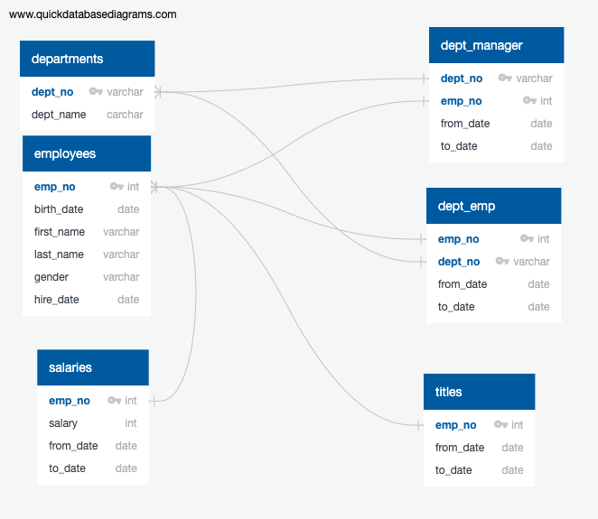
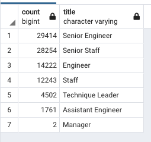
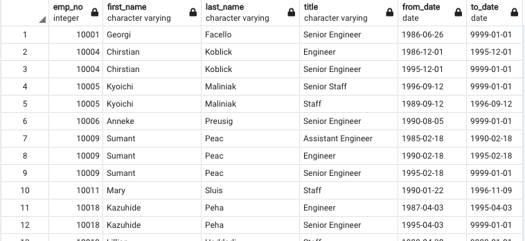
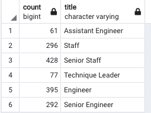

# Pewlett-Hackard-Analysis

### Overview of the analysis
The purpose for this analysis is to determine the number of Pewlett-Hackard retiring employees per title, and identify employees who are eligible to participate in a mentorship program. This is in order to prepare for the “silver tsunami” as many current employees reach retirement age. PostgreSQL was used to query CSVs and create new tables to show who will retire. Here is an ERD of the data tables that were used

### Results
* There are 90,398 Pewlett Hackard employees across 7 departments that are eligible for retirement this year. 
 
 
* The largest group of retirement eiligilble employees are the senior engineers with 29,414 employees. In stark contrast, smallest group of reitrement eligible employees is the Managers with only 2 emlployees
 
* Many of of these employees had multiple roles during their time at Pewlett Hackard. Here is a snippet of some employees who had multiple roles.
 

* Based on the amount of employees eligible for retirement, there are only 1,549 employees who can particiate in the mentorship program. Here are the mentorship eligible employees by title.
 
 

### Summary
There are 90,398 roles will need to be filled as the "silver tsunami" begins to make an impact. 

PENDING

There are only 1,549 qualified, retirement-ready employees in the departments to mentor the next generation of Pewlett Hackard employees. If Pewlett-Hackard hires 90,398 new people, here will not be enough qualified, retirement-ready employees in the departments to mentor the next generation of Pewlett Hackard employees.
